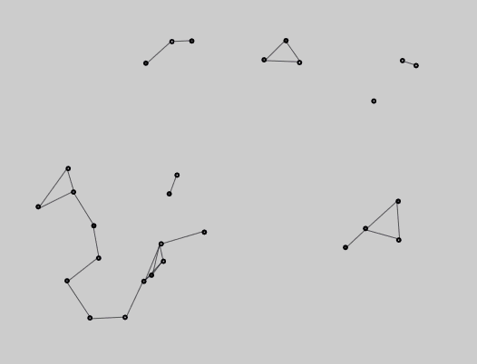
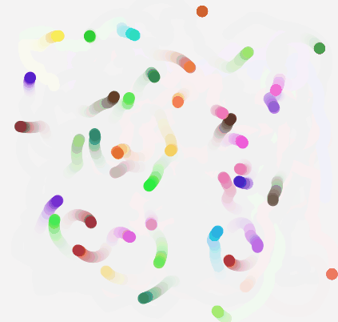

## Dancing circles

Browser game which lets you create circles which dance with each other.

https://dancing-circles.netlify.app

_Rules._ When two circles are close to each other (distance is less than 50 pixels), they start to rotate around the midpoint of their midpoints (clockwise by default). Circles which get outside of the canvas are removed.

When these rules are applied to many circles at a time, it produces a complex movement. Very interesting and non-predictable systems can arise already with 4 circles.

Mixing clockwise and anticlockwise circles can produce chaos, wild dancing or even 'black holes': these are groups of fast rotating circles which converge towards a point and suck in all nearby circles.

Click the canvas anywhere to generate a new circle at this point. In the menu you can adjust the size and the orientation of the next circle. You can also remove the last circle or even all circles. It is also possible to toggle lines between dancing circles.

Finally, there is also an option to show the trails of the circles.

